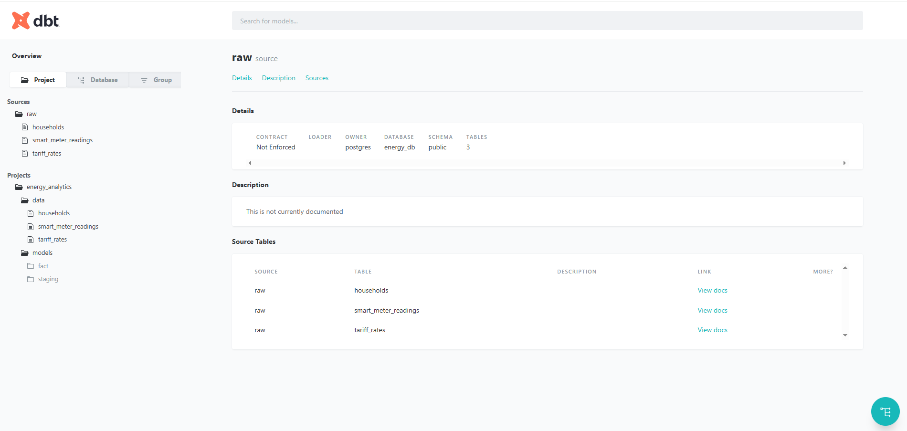
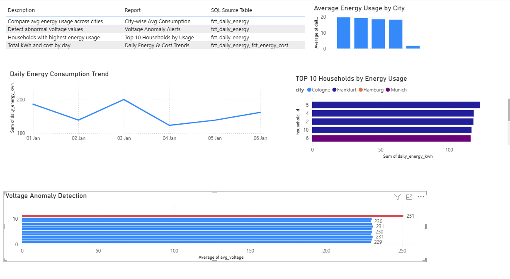

# 📘 Learning Project: Energy Analytics Dashboard with dbt + PostgreSQL + PowerBI

This project is designed as a **learning journey** to help you understand how to build an end-to-end analytics pipeline using **dbt**, **PostgreSQL**, and **PowerBI**, using simulated smart meter energy data.


> 

---

##  Learning Goals

- Understand how dbt works (models, seeds, tests, sources)
- Practice building transformations from raw data to insights
- Explore PostgreSQL as a warehouse for analytics
- Build PowerBI dashboards from SQL models


---

##  Project Structure Overview

```
.
├── ENERGY-USAGE-ANALYTICS/
   ├── dbt_project.yml       # dbt config file
   ├── models/
   │   ├── staging/          # Clean raw data into stg models
   │   ├── fact/             # Business logic (e.g., energy summaries)
   │   └── schema.yml        # Define sources, tests, and descriptions
   ├── data/                 # Seed data in CSV form
   ├── target                # dbt connection and run files
   └── snapshots/                # dbt dashboards and prebuilt dashboards 
```

---
## 📁 DBT File & Folder Overview

| File/Folder       | Purpose                                 |
| ----------------- | --------------------------------------- |
| `dbt_project.yml` | Project config (name, paths, settings)  |
| `models/`         | Your SQL logic and business rules       |
| `schema.yml`      | Tests + docs for models and sources     |
| `data/`           | CSVs for raw/seed data                  |
| `dbt_packages/`   | Installed packages (ignore in Git)      |
| `target/`         | Compiled files and logs (ignore in Git) |


##  Step-by-Step Instructions

## Set up dbt
pip install dbt-postgres
dbt debug


####  Load Raw Data into Postgres (data from /dbt_project/data/* is loaded in postgres database)

##  Seed Data Overview


| Seed File              | Description                                      |
|------------------------|--------------------------------------------------|
| `households.csv`       | Household metadata including city, meter ID, and installation date |
| `smart_meter_readings.csv` | Hourly readings of energy consumption, voltage, and current from each meter |
| `tariff_rates.csv`     | Tariff pricing over date ranges (for cost calculation) |

These tables are referenced as **sources** in dbt models and form the basis for all downstream transformations.

Run this to load them:


####  Transform Your Data
```
dbt run
```

####  Test Data Quality
```
dbt test
```

#### 📚 View Lineage & Docs
```bash
dbt docs generate
dbt docs serve

Console Output

Serving docs at 8080
To access from your browser, navigate to: http://localhost:8080
```


Explore your DAG, model descriptions, and test results.

---

## 📊 What You Will Build

### Dashboards in PowerBI
Connect to PostgreSQL, Load Data to PowerBI

| Report                        | Description                                      | Model/Table              |
|------------------------------|--------------------------------------------------|---------------------------|
| Daily Energy & Cost Trends   | kWh & cost over time                             | `fct_daily_energy`, `fct_energy_cost` |
| Top 5 Households by Usage    | Highest consumers by kWh                         | `fct_daily_energy`        |
| City-wise Avg Consumption    | Avg kWh per city                                 | `fct_daily_energy`        |
| Voltage Anomaly Alerts       | Detect when avg voltage is out of range          | `fct_daily_energy`        |

---
> 

##  Explore These Concepts

###  dbt Concepts

- `seeds`: load CSVs into your warehouse
- `models`: SQL files that transform data
- `sources`: define upstream tables (like `raw.smart_meter_readings`)
- `tests`: catch bad data early (e.g., `not_null`, `unique`)
- `ref()` and `source()`: create dependency graph
- `incremental models`: only load new data (advanced)

---

## 🔄 Suggested Next Steps

- Add **incremental logic** to `fct_daily_energy`
- Simulate streaming using **Kafka → PostgreSQL**
- Add more **anomaly detection logic**
- Deploy your pipeline to **Cloud (Azure/Snowflake/BigQuery)**
- Automate tests using **CI/CD (GitHub Actions)**

---


